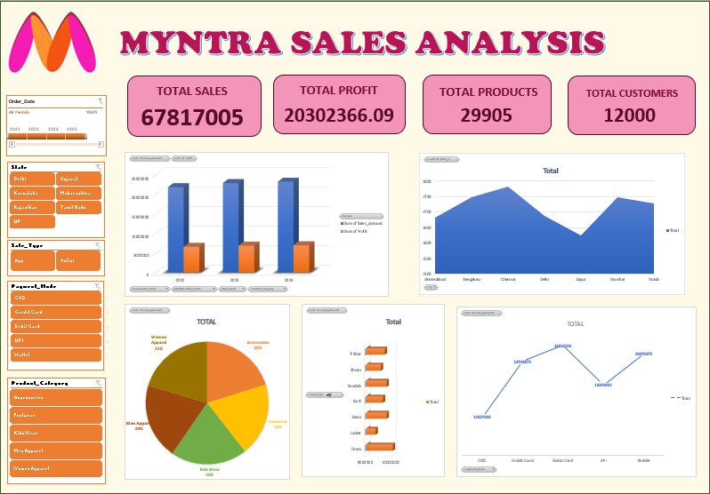

images(myntra.png)

<div align="center">


&nbsp;

&nbsp;


<br/><br/>

# 🛍️ Myntra Sales Analytics Dashboard

### An interactive Excel dashboard analyzing **₹6.78 Cr+** in sales across **12,000 orders** — spanning cities, categories, brands, and payment modes.

<br/>

</div>

---

## 📌 Overview

This project is an end-to-end **Excel Sales Dashboard** built on a Myntra e-commerce dataset. It transforms raw transactional data into clean, interactive pivot-driven insights — covering customer demographics, product performance, regional trends, and profitability.

> Think of it as a mini BI tool — built entirely in Excel.

---

## 🖼️ Dashboard Preview

<div align="center">



*Interactive Excel dashboard with slicers for Order Date, State, Sale Type, Payment Mode, and Product Category*

</div>

---

## 📊 Dashboard Highlights

| Metric | Value |
|--------|-------|
| 💰 Total Sales | ₹6,78,17,005 |
| 📦 Total Orders | 12,000 |
| 📈 Total Profit | ₹2,03,02,366 |
| 🛒 Total Quantity Sold | 29,905 units |
| 📅 Years Covered | 2022 · 2023 · 2024 |

---

## 🗂️ Workbook Structure

```
Myntra_DASHBOARD.xlsx
│
├── 📋 Data Sheet          → Raw transactional records (12,000 rows)
├── 📊 Pivot Table Sheet   → Aggregated summaries powering the dashboard
└── 📈 Dashboard Sheet     → Visual, interactive Excel dashboard
```

---

## 🔍 What's Inside the Data

Each row represents a single order with **19 columns**:

| Column | Description |
|--------|-------------|
| `Order_ID` | Unique order identifier (MYN100000 …) |
| `Order_Date` / `Ship_Date` | Transaction and delivery dates |
| `Customer_ID` | Unique customer reference |
| `Customer_Gender` | Male / Female |
| `Customer_Age` | Age of the customer |
| `State` / `City` | Geographic location |
| `Product_Category` | Men Apparel · Women Apparel · Kids Wear · Footwear · Accessories |
| `Product_Name` | Jeans · Jacket · T-Shirt · Kurti · Dress · Sandals · Shoes |
| `Brand` | Nike · Adidas · Puma · HRX · Wrogn · Biba · Roadster |
| `Sale_Type` | Online / App |
| `Payment_Mode` | UPI · Wallet · COD · Credit Card · Debit Card |
| `Quantity` | Units per order |
| `Unit_Price` | Price per item (₹) |
| `Sales_Amount` | Total sale value (₹) |
| `Cost_Price` | Cost of goods |
| `Profit` | Gross profit (₹) |
| `Profit_%` | Profit margin (%) |

---

## 📈 Key Insights (from Pivot Tables)

### 🏙️ Sales by City
| City | Orders |
|------|--------|
| Chennai | 1,782 |
| Bengaluru | 1,747 |
| Mumbai | 1,748 |
| Noida | 1,729 |
| Delhi | 1,687 |
| Ahmedabad | 1,683 |
| Jaipur | 1,624 |

### 👗 Sales by Category
| Category | Revenue |
|----------|---------|
| Women Apparel | ₹1,38,45,439 |
| Accessories | ₹1,36,58,289 |
| Kids Wear | ₹1,36,56,453 |
| Men Apparel | ₹1,35,46,497 |
| Footwear | ₹1,31,10,327 |

### 💳 Sales by Payment Mode
| Payment | Revenue |
|---------|---------|
| Wallet | ₹1,38,70,479 |
| Debit Card | ₹1,40,16,226 |
| Credit Card | ₹1,37,43,875 |
| UPI | ₹1,33,59,392 |
| COD | ₹1,28,27,033 |

### 📅 Year-on-Year Growth
| Year | Sales | Profit |
|------|-------|--------|
| 2022 | ₹2,17,90,211 | ₹65,30,048 |
| 2023 | ₹2,28,38,575 | ₹68,39,682 |
| 2024 | ₹2,31,88,219 | ₹69,32,635 |

> 📌 Consistent YoY growth — ~6.4% revenue increase from 2022 → 2024

---

## 🧰 Tools & Techniques Used

- **Microsoft Excel** — Pivot Tables, Pivot Charts, Slicers
- **Data Cleaning** — Structured table formatting, date parsing
- **Dashboard Design** — KPI cards, bar charts, donut charts, slicers for interactivity
- **Calculated Fields** — Profit, Profit %, Sales Amount derived metrics

---

## 🚀 How to Use

1. **Download** the `.xlsx` file
2. **Open** in Microsoft Excel (2016 or later recommended)
3. Navigate to the **DASHBOARD** sheet
4. Use the **slicers** (filters) to explore data by City, Category, Year, Gender, Brand, or Payment Mode
5. All charts and KPIs update **automatically** with your selections

---

## 📁 Dataset Details

- **Source**: Synthetic Myntra e-commerce sales data
- **Rows**: 12,000 orders
- **Period**: 2022 – 2024
- **Cities**: Ahmedabad, Bengaluru, Chennai, Delhi, Jaipur, Mumbai, Noida
- **Brands**: Nike, Adidas, Puma, HRX, Wrogn, Biba, Roadster
- **Categories**: Men Apparel, Women Apparel, Kids Wear, Footwear, Accessories

---

## 📬 Contact

Feel free to open an issue or reach out if you have questions, suggestions, or want to collaborate!

---

<div align="center">
